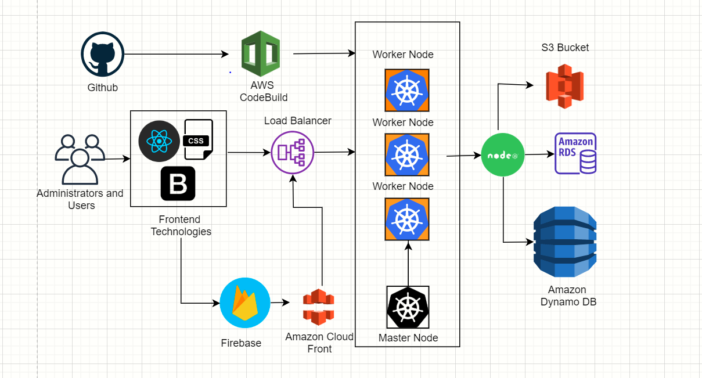

# Tara

# Approved - Tara

Tara
A place where talent meets opportunity.

# Team

- Bhavana Chowdary
- Thanmai Gajam
- Prasanna
- Vijayashree
- Baijun Jiang

# Concept and Advisory

Siva Sreeraman

We followed agile methodology by having weekly Scrum with Siva and it helped us in meeting the check points and deliver things at right time.

# Abstract

Tara is about Creativity Management and Talent Management.Creativity Management deals with user,he can either create a project
or participate in the project and admin maintains all the functionalities like assigning role base access to users, scheduling events,tasks and can maintain the whole project communication with the  users in the project using this application.Talent Management deals with the people who wants to recruit the  dedicated people in their projects and also helps the people who want to find jobs in different domains in the movie sector.

TARA is here .. Come build your dream future with us. This is the place where real talent meets the right opportunity and where you can maintain your project activities.

# Who are we?

Tara is a real-time entertainment-industry brand aimed at connecting local performing talent, with a special focus on casting, job opportunities, and creativity management for the people who starts a new project.

# Persona/Target Users:

Talent Management:

Where Talent meets Opportunity.

Talent:
Performing artists and backstage professionals looking for work in film, television, theater, commercials, voiceover, radio, gaming and other mediums who seek opportunity to find their next role and manage their careers.

Opportunity:
Casting directors and recruiters looking to hire the perfect artistic talent and professional backstage crew for their projects.

Creativity Management: All the department people can assign activities to other departments based on their role based access and can easily communicate among themselves.

# Hill Statement

Tara: Bringing together Talent and Opportunity in the Performing Arts industries through a common platform.

#Technology stack
 Frontend-React,bootstrap,css,material-uI
 Authentication- Firebase
 Backend: Node js
 Database: RDS,Dynamo db,s3 bucket
 cloud technologies: kubernetes,AWS
 
 
 

